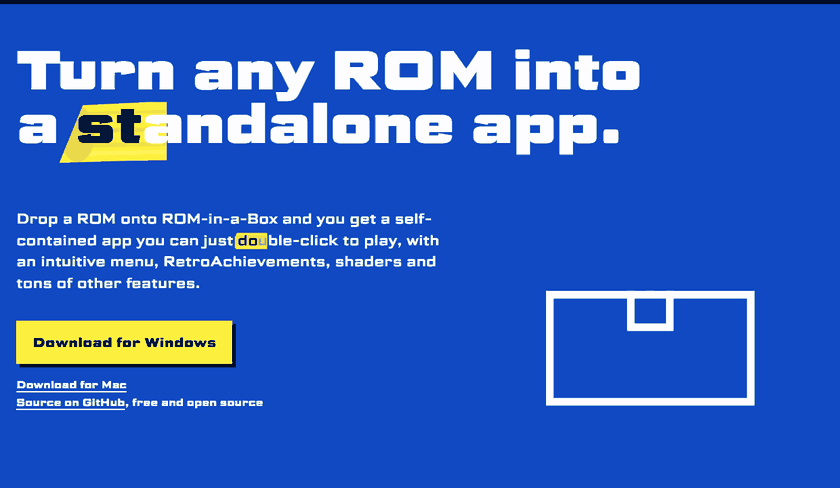

<p align="center">
  <a href="https://www.rominabox.app"></a>
</p>

# ROM-in-a-Box

ROM-in-a-Box is an app that bundles a ROM with a custom version of RetroArch into a standalone app for macOS or Windows. In other words, turn any ROM into a standalone app.

**[Website](https://www.rominabox.app)** · **[Download](https://github.com/Jorl17/rominabox/releases/latest)**

## Features

- Drop a ROM, check its name, console and box art, choose a menu design, and export an app for Mac, Windows or both.
- Double-click the app to play. Press Esc for a menu with save slots, controls, shaders and settings.
- RetroAchievements, with the possibility of sharing one sign-in across every ROM-in-a-Box game.
- Any RetroArch-compatible shader, and controller remapping on a picture of each console's pad.
- ROM hacks in IPS, UPS, BPS, xdelta and PPF, applied when you export.
- Every game has its own settings and saves, and runs in a sandbox.

For the full list of features, see [rominabox.app](https://www.rominabox.app).

## Getting the source

RetroArch is in our fork, [rominabox-retroarch](https://github.com/Jorl17/rominabox-retroarch), included as a submodule:

```sh
git clone --recurse-submodules https://github.com/Jorl17/rominabox.git
```

## Building

You need [Node.js](https://nodejs.org), [Rust](https://www.rust-lang.org) with [Tauri's prerequisites](https://tauri.app/start/prerequisites/), and [uv](https://docs.astral.sh/uv/) for the scripts. To build the player (our RetroArch), you also need Git, CMake, Ninja, pkg-config and Xcode's command line tools on macOS, or MSYS2's UCRT64 toolchain on Windows.

To work on the builder's interface in a browser, without building RetroArch:

```sh
cd desktop
npm ci
npm run dev
```

Then open <http://127.0.0.1:1420/>.

To build the whole builder (the player, its runtime kit, the menu renderer and the builder itself), from the repository root:

```sh
cd desktop && npm ci && cd ..
uv run python scripts/build_builder.py
```

The result is a signed `.app` on macOS and an installer on Windows.

## Tests

```sh
uv run python scripts/test.py              # the fast scopes
uv run python scripts/test.py menu frontend # one or more scopes
uv run python scripts/test.py --all        # everything, including the slow scopes that start games
uv run python scripts/test.py --list       # what each scope covers, and what it leaves out
```

The slow scopes need a built player and runtime kit, so run `scripts/build_builder.py` once first. The games they start run with a hidden window.

**SLOW next to a scope.** Its run took more than twice as long as its last recorded time (`scripts/fixtures/scope-budgets.json`). It is a note about speed, not a failure.

**STALE files in the staging scope.** The kit's copies of the menu designs are older than the designs. Run `uv run python scripts/kit_assets.py` to copy them again.

**Skipped tests.** Some tests need a game or disc that the repository does not contain, and `scripts/fetch_test_content.py` downloads it. When the download is not possible, those tests are skipped, with the reason in the output.

## Menu designs

A menu design is a folder of RmlUi markup and stylesheets in `integrations/designs/`. To make one, follow [Writing a menu design](docs/design-authoring.md), and see [the screen contract](docs/screen-contract.md) for the elements every screen must have.

You can look at a design without starting a game:

- The Menu step of the builder shows a preview of the chosen design and palette.
- `rominabox-cli preview` draws a design's pause screen into a PNG, as described in [Checking a design](docs/design-authoring.md#checking-a-design).
- `uv run python scripts/menu_states.py work/menu-states` draws every state of every design in every palette.

## Command line

`rominabox-cli` does everything the builder does, through the same Rust code: identification, previews, projects and export. Commands read JSON on stdin and write JSON Lines on stdout. Run it with `--help`, or `schemas` for the full interface. In a built builder it is at `ROM-in-a-Box.app/Contents/Resources/bin/rominabox-cli` on macOS, and on the PATH after installing on Windows.

There is also a [skill for AI agents](plugin/skills/rominabox/SKILL.md) that describes how to use `rominabox-cli`. It is an idea from the early days of the project, and we have not kept it up to date.

## Things to know

- A runtime kit (the player and its files for one platform) can be built only on its own platform. For games for the other platform, that platform's kit is downloaded from this repository's releases when an export needs it.
- Changes to RetroArch go into the fork first. Commit there, then commit the new submodule pointer here.
- Run every script with `uv run python`, so every machine uses the same Python and packages.
- Run `git config core.hooksPath .githooks` to use our hooks. With them, the whole test suite runs before every push.

## Project structure

- `desktop/`: the builder (Tauri and React) and, in `desktop/crates/rominabox-engine`, the Rust engine and the `rominabox-cli` command line.
- `vendor/retroarch/`: our RetroArch fork, with the in-game menu.
- `integrations/`: consoles, menu designs, shaders and controller profiles.
- `scripts/`: building, packaging and tests.
- `docs/`: guides to [menu designs](docs/design-authoring.md), [console packages](docs/console-packages.md), [menu sounds](docs/menu-sounds.md) and [the native runtime](docs/native-runtime.md).

## License

ROM-in-a-Box is licensed under the [GNU General Public License v3.0](LICENSE) or later.
Copyright (C) 2026 João Ricardo Lourenço.

The licences of third-party components are in [`licenses/`](licenses/).

ROM-in-a-Box does not include any games. Use it with games you own.
